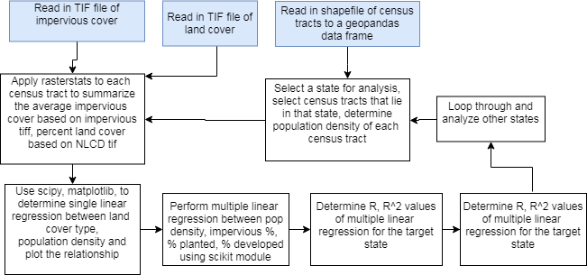

# Project Plan

## General Process
1) Use `geopandas` to read in the TIF file into a `DataFrame`
2) Clip out each state based on GEOID using `rasterio` and save into a `DataFrame` for each state
3) Create analysis methods for a state `DataFrame` that create $r$ and $R^2$ in the state's attribute table
4) Display the distributions on the state maps
5) Discuss

## Analysis Key Methods
> Essentially follow flow chart - each box can be a method

## Packages
- `zoneanalysis` to extract population density and land cover area percentage
- `rasterio` for clipping out each state from NLCD
- `geopandas` for reading in TIF file into `DataFrame`
- `pandas` (or `scipy` or `numpy`) for performing statistics (Pearson correlation coefficient and multiple linear regression)